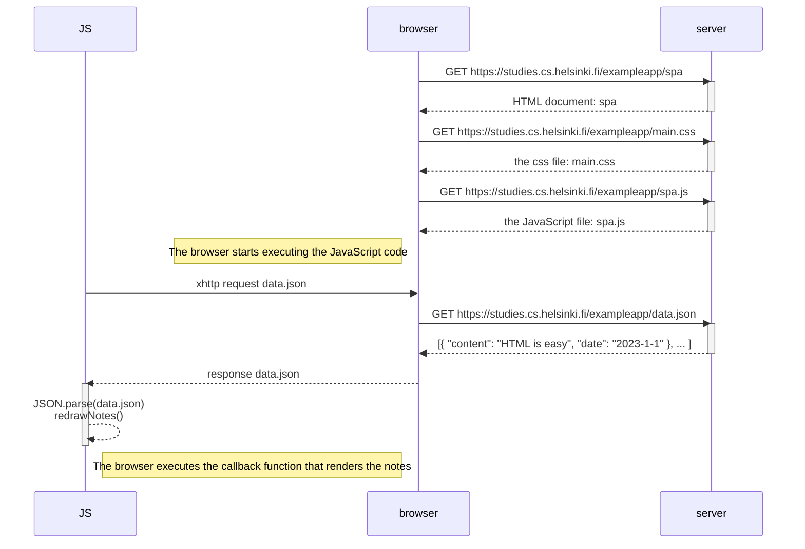

```mermaid
sequenceDiagram
    participant JS
    participant browser
    participant server

    browser->>server: GET https://studies.cs.helsinki.fi/exampleapp/spa
    activate server
    server-->>browser: HTML document: spa
    deactivate server

    browser->>server: GET https://studies.cs.helsinki.fi/exampleapp/main.css
    activate server
    server-->>browser: the css file: main.css
    deactivate server

    browser->>server: GET https://studies.cs.helsinki.fi/exampleapp/spa.js
    activate server
    server-->>browser: the JavaScript file: spa.js
    deactivate server

    Note left of browser: The browser starts executing the JavaScript code

    JS->>browser: xhttp request data.json

    browser->>server: GET https://studies.cs.helsinki.fi/exampleapp/data.json
    activate server
    server-->>browser: [{ "content": "HTML is easy", "date": "2023-1-1" }, ... ]
    deactivate server

    browser-->>JS: response data.json
    activate JS
        JS-->>JS: JSON.parse(data.json)<br/>redrawNotes()
    deactivate JS

    Note left of browser: The browser executes the callback function that renders the notes
```
