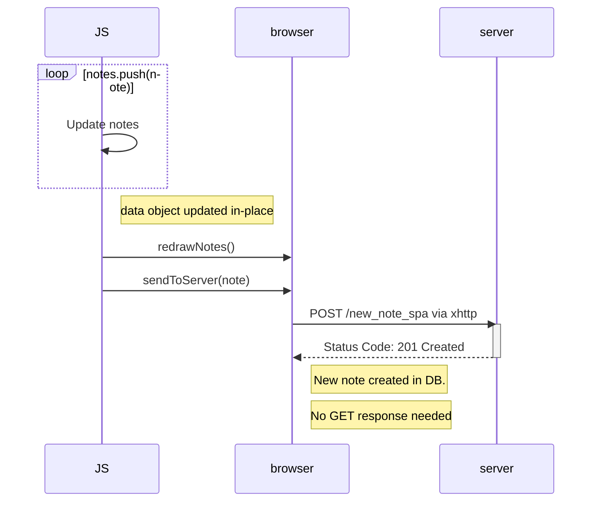

```mermaid

sequenceDiagram
    participant JS
    participant browser
    participant server
    
    loop notes.push(note)
        JS->>JS: Update notes
    end
    Note right of JS: data object updated in-place
    
    JS->>browser: redrawNotes()
    JS->>browser: sendToServer(note)
    
    browser->>server: POST /new_note_spa via xhttp
    activate server
    server-->>browser: Status Code: 201 Created
    deactivate server
    
    Note right of browser: New note created in DB.
    Note right of browser: No GET response needed
```
